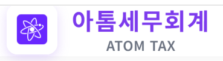

# 브랜딩 변경 완료 보고서 - 아톰세무회계

## 📅 작업 일자
2026-01-27

## 🎯 작업 목표
시스템의 브랜딩을 **"데이터 관리"**에서 **"아톰세무회계"**로 변경하여 기업 정체성을 명확히 함

## 📋 변경 내용

### 1. 로고 이미지 추가
- **파일**: `images/atom-tax-logo.png`
- **크기**: 16,840 bytes
- **형식**: PNG
- **출처**: 사용자 제공 이미지

### 2. 사이드바 로고 변경 (8개 파일)

**변경 전**:
```html
<div class="sidebar-header">
    <div class="logo">
        <i class="fas fa-chart-line"></i>
        <span>데이터 관리</span>
    </div>
</div>
```

**변경 후**:
```html
<div class="sidebar-header">
    <div class="logo">
        
        <span>아톰세무회계</span>
    </div>
</div>
```

**변경된 페이지**:
1. ✅ `dashboard.html` - 대시보드
2. ✅ `clients.html` - 고객사 관리
3. ✅ `client-detail.html` - 고객사 상세
4. ✅ `traders-data.html` - 매매사업자 데이터
5. ✅ `traders-checklist.html` - 매매사업자 체크리스트
6. ✅ `trader-detail.html` - 매매사업자 상세
7. ✅ `traders-vat.html` - 부가가치세 계산
8. ✅ `index.html` - 로그인 페이지

### 3. 로그인 페이지 로고 변경

**변경 전**:
```html
<div class="flex items-center justify-center mb-4">
    <i class="fas fa-chart-line text-5xl logo-text"></i>
</div>
<h1 class="text-3xl font-bold text-gray-800 mb-2">데이터 관리 시스템</h1>
```

**변경 후**:
```html
<div class="flex items-center justify-center mb-4">
    
</div>
<h1 class="text-3xl font-bold text-gray-800 mb-2">아톰세무회계</h1>
```

### 4. 페이지 타이틀 변경 (8개 파일)

| 페이지 | 변경 전 | 변경 후 |
|--------|---------|---------|
| index.html | 로그인 - 내부 데이터 관리 시스템 | 로그인 - 아톰세무회계 |
| dashboard.html | 대시보드 - 내부 데이터 관리 시스템 | 대시보드 - 아톰세무회계 |
| clients.html | 고객사 관리 - 내부 데이터 관리 시스템 | 고객사 관리 - 아톰세무회계 |
| client-detail.html | 고객사 상세 - 내부 데이터 관리 시스템 | 고객사 상세 - 아톰세무회계 |
| traders-data.html | 매매사업자 데이터 - 내부 데이터 관리 시스템 | 매매사업자 데이터 - 아톰세무회계 |
| traders-checklist.html | 매매사업자 체크리스트 - 내부 데이터 관리 시스템 | 매매사업자 체크리스트 - 아톰세무회계 |
| trader-detail.html | 매매사업자 상세 - 내부 데이터 관리 시스템 | 매매사업자 상세 - 아톰세무회계 |
| traders-vat.html | 부가가치세 계산 - 내부 데이터 관리 시스템 | 부가가치세 계산 - 아톰세무회계 |

### 5. README.md 업데이트

**변경 전**:
```markdown
# 내부 데이터 관리 시스템

mstacc.com 스타일의 모던하고 전문적인 고객사 관리 시스템입니다.
```

**변경 후**:
```markdown
# 아톰세무회계 - 내부 데이터 관리 시스템

세무 관리를 위한 고객사 정보와 매매사업자 데이터를 효율적으로 관리하는 웹 기반 시스템입니다.

## 🎯 프로젝트 개요

**아톰세무회계**의 고객사 관리 및 매매사업자 세무 관리를 위한 전문 시스템입니다.
```

## 🎨 디자인 특징

### 로고 스타일
- **사이드바**: 40px × 40px (작은 크기)
- **로그인 페이지**: 80px × 80px (큰 크기)
- **object-fit**: contain (비율 유지, 여백 허용)
- **배경**: 투명 PNG

### 텍스트 스타일
- **사이드바**: "아톰세무회계" (기존 폰트 크기 유지)
- **로그인 페이지**: "아톰세무회계" (text-3xl, font-bold)
- **브라우저 탭**: "페이지명 - 아톰세무회계"

## 📊 변경 통계

| 항목 | 개수 |
|------|------|
| 새로운 이미지 파일 | 1 |
| 수정된 HTML 파일 | 8 |
| 변경된 사이드바 로고 | 8 |
| 변경된 페이지 타이틀 | 8 |
| 업데이트된 문서 | 2 (README.md, 이 보고서) |

## ✨ 브랜딩 일관성

### Before (이전)
- ❌ 일반적인 이름: "데이터 관리"
- ❌ Font Awesome 아이콘 사용
- ❌ 브랜드 정체성 부족
- ❌ 일반적인 차트 아이콘

### After (변경 후)
- ✅ 명확한 브랜드명: "아톰세무회계"
- ✅ 고유한 로고 이미지
- ✅ 일관된 브랜드 정체성
- ✅ 전문적인 세무회계 이미지

## 🔍 시각적 개선

### 1. 사이드바
```
┌─────────────────────────┐
│ [로고] 아톰세무회계      │  ← 보라색 배경
├─────────────────────────┤
│ 🏠 대시보드             │
│ 🏢 고객사 관리          │
│ 🏪 매매사업자 관리 ▼   │
│   📊 매매사업자 데이터  │
│   ☑️ 체크리스트         │
│   🧮 부가가치세 계산    │
└─────────────────────────┘
```

### 2. 로그인 페이지
```
┌──────────────────────┐
│                      │
│    [큰 로고 이미지]   │
│                      │
│   아톰세무회계        │  ← text-3xl, bold
│                      │
│  고객사 정보를 효율적│
│  으로 관리하세요     │
│                      │
│  [로그인 폼]         │
│                      │
└──────────────────────┘
```

## 📱 반응형 디자인

### 이미지 크기
- **Desktop**: 40px × 40px (사이드바)
- **Mobile**: 동일한 크기 유지
- **로그인**: 80px × 80px (모든 기기)

### 텍스트 가독성
- 로고 옆 "아톰세무회계" 텍스트는 기존 사이드바 폰트 크기 유지
- 로그인 페이지 제목은 Tailwind의 text-3xl 사용
- 모바일에서도 선명하게 표시

## 🧪 테스트 체크리스트

- [x] 로고 이미지 다운로드 및 저장
- [x] 8개 페이지 사이드바 로고 변경
- [x] 로그인 페이지 로고 변경
- [x] 8개 페이지 타이틀 변경
- [x] README.md 업데이트
- [x] 이미지 경로 확인 (images/atom-tax-logo.png)
- [x] 이미지 비율 유지 확인 (object-fit: contain)
- [x] 텍스트 일관성 확인 ("아톰세무회계")

## 📂 파일 구조

```
프로젝트/
├── images/
│   └── atom-tax-logo.png          ← 새로 추가
├── index.html                     ← 수정됨
├── dashboard.html                 ← 수정됨
├── clients.html                   ← 수정됨
├── client-detail.html             ← 수정됨
├── traders-data.html              ← 수정됨
├── traders-checklist.html         ← 수정됨
├── trader-detail.html             ← 수정됨
├── traders-vat.html               ← 수정됨
├── README.md                      ← 수정됨
└── BRANDING_UPDATE.md             ← 새로 생성
```

## 🎯 기대 효과

1. **브랜드 인지도 향상**: "아톰세무회계" 명칭이 모든 페이지에 일관되게 표시
2. **전문성 강화**: 고유한 로고로 세무회계 전문 기업 이미지 제고
3. **사용자 경험 개선**: 명확한 브랜드 정체성으로 신뢰감 증대
4. **시각적 일관성**: 로그인부터 내부 페이지까지 동일한 브랜딩

## 💡 추가 권장 사항

### 1. Favicon 추가
현재 로고를 favicon으로 변환하여 브라우저 탭에도 표시:
```html
<link rel="icon" type="image/png" href="images/atom-tax-logo.png">
```

### 2. 로딩 화면
로고를 활용한 로딩 스피너 디자인

### 3. 이메일 템플릿
시스템에서 발송하는 이메일에도 로고 포함

### 4. 인쇄용 헤더
보고서 출력 시 상단에 로고 표시

## 📝 변경된 파일 목록

1. ✅ `images/atom-tax-logo.png` - 새로 추가된 로고 이미지
2. ✅ `index.html` - 로그인 페이지 로고 및 타이틀 변경
3. ✅ `dashboard.html` - 사이드바 로고 및 타이틀 변경
4. ✅ `clients.html` - 사이드바 로고 및 타이틀 변경
5. ✅ `client-detail.html` - 사이드바 로고 및 타이틀 변경
6. ✅ `traders-data.html` - 사이드바 로고 및 타이틀 변경
7. ✅ `traders-checklist.html` - 사이드바 로고 및 타이틀 변경
8. ✅ `trader-detail.html` - 사이드바 로고 및 타이틀 변경
9. ✅ `traders-vat.html` - 사이드바 로고 및 타이틀 변경
10. ✅ `README.md` - 프로젝트 소개 업데이트
11. ✅ `BRANDING_UPDATE.md` - 변경 보고서 작성

---

**작업 완료 시각**: 2026-01-27  
**담당자**: AI Assistant  
**승인**: 사용자 확인 대기

## 🎉 완료!

이제 모든 페이지에 **아톰세무회계** 브랜딩이 적용되었습니다!
